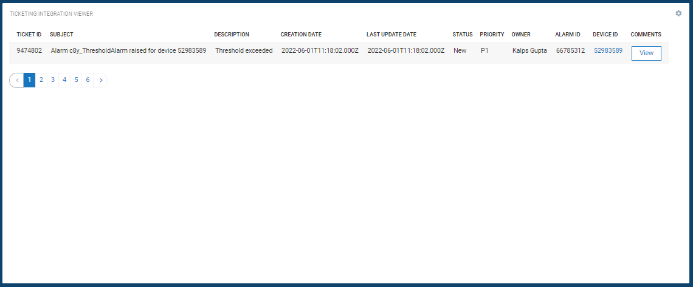

# Ticketing Integration Viewer Widget for Cumulocity IoT

This widget allows...

### Installation - for the dashboards using Runtime Widget Loader
1. Download the latest `c8y-ticketing-integration-viewer-widget-{version}.zip` file from the Releases section.
2. Make sure you have Application Builder app installed.
3. Open a dashboard.
4. Click `more...`.
5. Select `Install Widget` and follow the instructions.

### Configuration - to add the widget on dashboard
1. Make sure you have successfully installed the widget.
2. Click on `Add widget`.
3. Choose `Ticket Integration Viewer` widget.
4. `Title` is the title of widget. Provide a relevant name. You may choose to hide this. Go to `Appearance` tab and choose `Hidden` under `Widget header style`.
5. Choose `Target assets or devices` to view tickets for that specific device or leave unselected to view all tickets.
6. Select or unselect respective table columns in `Show columns` to be shown in table.
7. `Max total tickets` is total number of tickets to be retrieved from ticketing platform.
8. `Page size` is total number of tickets to shown at once in a table.
9. Click `Save` to add the widget on the dashboard.
10. In case you see unexpected results on the widget, refer to browser console to see if there are error logs.

### Development - to do the enhancements and testing locally
1. Clone the repository on local machine using `git clone https://github.com/SoftwareAG/c8y-ticketing-integration-viewer-widget.git`.
2. Run `npm install` to download the module dependencies.
3. Install c8ycli `npm install -g @c8y/cli` if not already.
4. Run `c8ycli server -u https://your_tenant_url` to start the server.
5. Go to `http://localhost:9000/apps/cockpit/` in the browser to view and test your changes.
6. (Optional) push the changes back to this repository.

### Build - to create a new build for the Runtime Widget Loader
1. Finish the development and testing on your local machine.
2. Run `gulp` to start the build process. Run `npm install -g gulp` to install gulp if not already.
3. Use `c8y-ticketing-integration-viewer-widget-{version}.zip` file in the `dist` folder as a distribution.

------------------------------

These tools are provided as-is and without warranty or support. They do not constitute part of the Software AG product suite. Users are free to use, fork and modify them, subject to the license agreement. While Software AG welcomes contributions, we cannot guarantee to include every contribution in the master project.

------------------------------

For more information you can Ask a Question in the [TECHcommunity Forums](http://tech.forums.softwareag.com/techjforum/forums/list.page?product=cumulocity).
  
  
You can find additional information in the [Software AG TECHcommunity](http://techcommunity.softwareag.com/home/-/product/name/cumulocity).